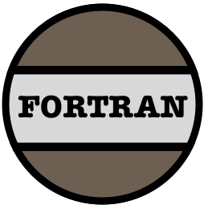

### Hello I'm Neil!

### Aliases:

RandomKiddo
 
firsttry

<!--
**RandomKiddo/RandomKiddo** is a ✨ _special_ ✨ repository because its `README.md` (this file) appears on your GitHub profile.

### Main Languages:

### Tools:

### Other Languages:

